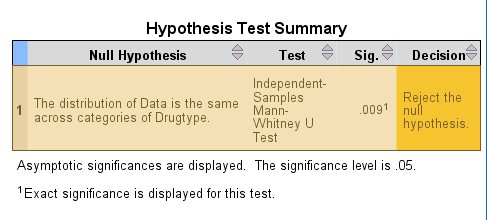
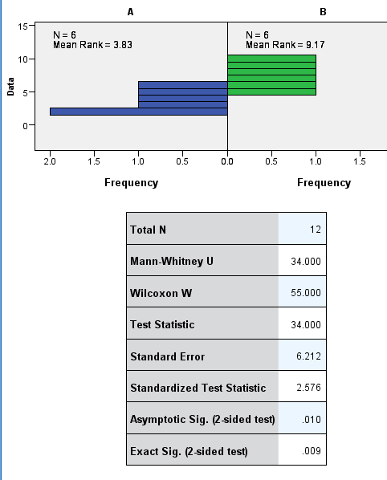

```{r setup, include=FALSE}
knitr::opts_chunk$set(echo = TRUE)
```

---

_
Comment: Rmarkdown tables are fiddly, and the documentation is not immediately obvious.  (Look at the pandoc markdown pages.)  The best table formats are grid (see Q1) and multiline (see Q2).
_

## Part 1: Non-parametric comparisons of averages

__
1. Patients admitted to an emergency room suffering from severe injuries were treated using two different pain-control medications; some patients received Drug A and others Drug B. After the medications had been given time to take effect, the patients were asked to rank their pain level on a scale from 1 to 10 (with 1 being mild discomfort and 10 being unbearable agony). You want to know whether one drug is more effective than the other.
__


+--------+---+---+---+----+---+---+
| Drug A | 3 | 4 | 2 | 6  | 2 | 5 |
+--------+---+---+---+----+---+---+
| Drug B | 9 | 7 | 5 | 10 | 6 | 8 |
+--------+---+---+---+----+---+---+

```{r}
a.df <- data.frame(painlevel = c(3,4,2,6,2,5))
b.df <- data.frame(painlevel = c(9,7,5,10,6,8))

```

__
a) What scale is the data measured on?
__

Discrete, ordinal data.

__
b) Are you able to use a parametric test with this data?
__

No, parametric tests are for continuous variables.

__
c) What statistical test will you use to analyse this data?
__

We wish to compare two independent groups of ordinal data. The _Mann-Whitney U test_ compares medians for such data.
__
d) What will your null hypothesis (H0) be for this analysis?
__

H0: The median pain level for drug A and drug B are the same. That is,
$$
{Median}_A( pain level) = {Median}_B( pain level)
$$

__
e) What will your alternate hypothesis (H1) be for this analysis?
__

H0: The median pain level for drug A and drug B are different. That is,
$$
{Median}_A( pain level) \ne {Median}_B( pain level)
$$

__
f) What are the assumptions of your chosen test?
__

From the lecture:

 1. Samples must be large enough to generate a value > 0 in the critical U value table
 2. The data in each category must have a similar distribution (but do not need to be normal)
 
__
g) Do the data satisfy these assumptions? (Give your evidence here.)
__

1. By inspecting a printed table, we see that as both groups have 6 samples, this assumption is met.  Let's do it in code.  It takes a few tries to match the table in the lecture/tutorial.

```{r}
qwilcox(0.95, length(a.df$painlevel), length(b.df$painlevel))
qwilcox(0.95, length(a.df$painlevel), length(b.df$painlevel),lower.tail=FALSE)
qwilcox(0.975, length(a.df$painlevel), length(b.df$painlevel),lower.tail=FALSE)
```

Note that here we use quantiles at the lower tail of the distribution, (if we take the lower of the two candidates for the U statistic).  Also we use here a two-tailed distribution, so we split alpha between the tails and supply 0.975 as the probability.  `qwilcox` is in the base `stats` library, so we don't need to load ("import") other libraries.

```{r}
if ( qwilcox(0.975, length(a.df$painlevel), length(b.df$painlevel),lower.tail=FALSE) >0 ) {print( "assumption 1 met")} else {print("assumption 1 not met")} 
```

Now to compare the similarity of the distributions.  We have been doing this "by eye."  Both the phrasing and the method are imprecise. The lecture notes elaborate on the meaning of "similar distributions" which broadly means that the distributions are the same apart from a shift in location.  Under this assumption the Mann-Whitney test - which actually tests whether two distributions are equal - becomes a test of medians, because we have supposed that the distributions are the same apart from location.

```{r}
# Plot both histograms on the one window, note transparency of 1/4 in rgb allows colour blending where there is overlap
blue<-rgb(0,0.45,0.7,1/4)
orange<-rgb(0.9,0.6,0,1/4)
hist(a.df$painlevel, col=blue, xlim=c(0,10), xlab = "Pain Level", main='Histogram of Pain Level')  # first histogram
hist(b.df$painlevel, col=orange, xlim=c(0,10),add=TRUE)  # secondhistogram, bars only added to first plot
legend("topright",c("Drug A","Drug B"), fill=c(blue,orange))

```

These distributions _appear_ similar. I have yet to find a formal test that distributions are similar apart from a shift of centre - except for the Mann Whitney test!  One might test that the variances and a few higher moments are statistically indistinguishable (in a non-parametric way), but I would need to see what work there is in support of that, and it may not be sufficient.  There appear to be many subtleties and complications with MW-U, so we will rest content with a visual check.


__
h) Calculate the test statistic for this analysis.
__

First, using R's supplied test:

```{r}
wilcox.test(a.df$painlevel, b.df$painlevel, paired=FALSE)
```

Note that the help page says that if two sample groups are supplied, and paired is `FALSE`, then `wilcoxl.test` returns _'a Wilcoxon rank sum test (equivalent to the Mann-Whitney test ...)'_   The returned statistic is here named $W$ but this appears to be equivalent to our $U$ - the literature shows some variation in the naming here.  The computed statistic $W=2$ agrees with our manual computation in Excel.

The test has accepted the alternative hypothesis. The p-value is not reliable, so we declare only that $p<0.05$.

Now let's do it the 'hard' way!


__
i) What is the critical value of the test statistic for this test α = 0.05 (from the critical table)?
__

```{r}
# as before
qwilcox(0.975, length(a.df$painlevel), length(b.df$painlevel),lower.tail=FALSE)
```

Hmm. Here we have disagreement with the MW-U table supplied in the tutorial, which indicates $U_\rm{crit} (6,6) = 5$.  Our conclusion won't change, but it would be nice to resolve this discrepancy.  One of my texts gives the value at the other tail; another gives $U_\rm{crit} (6,6) = 5$.  Is there a bug in the R code for `qwilcox`?  I will compare the tables in another project. (see TEST\_QWILCOX\_R project - many tables disagree - the unit discrepancy could be due to whether the inequality defining the critical value is strict or not).

__
j) Do you accept or reject your null hypothesis α = 0.05?
__

As $U_{\rm calc} < U_{\rm crit}$, we reject the null hypothesis.

__
k) What does this mean for your alternate hypothesis?
__

We accept the alternative hypothesis.

__
l) Report your results in the correct format.
__


The median pain level for drugs A and B are different (Mann-Whitney U test of median difference, $U_{\rm (6,6)} = 2$, $p < 0.05$)

__
m) Enter the data into SPSS. Use SPSS to test the assumptions of your chosen statistical test and to test your null hypothesis (refer to the textbook or to the file <SPSS V20 Instructions> on LEO if necessary). Do your conclusions from SPSS agree with your conclusions from calculating the test by hand?
__


Here is an experiment in embedding images. Last time I tried to paste ascii output from SPSS, (Anova) it didn't look great. This time I will embed some screen grabs of SPSS output. (Rstudio: tab-completion finds filenames, sweet!)





Observe that SPSS reports $U=34$. This is the U-value from the upper tail, so SPSS is using an upper-tail variant of MW-U. $(34 = 6 \times 6 - 2)$

---

__
2. A number of arthritis sufferers agree to participate in a trial of two new drugs, Drug A and Drug B. The patients each used both drugs and were asked to record the length of time that each drug provided relief from arthritic pain. Is there any evidence that one drug is more effective than the other? Test the data with a Wilcoxon signed rank test.
__


---------------------------------------------------------------------
  Patient     1     2     3      4     5      6      7     8     9    
---------    ---   ----- ------ ----- ------ ----- ------ ----- -----
  Drug A      7     8.6   14.3   6.8   12.1   6.9    5.1   1.6   4.5  
  
  Drug B      4     2.5   3.5    6.9   7.3    14.2   5.1   1.4   8.3  
---------------------------------------------------------------------

```{r}

drugA <- c(7, 8.6, 14.3, 6.8, 12.1, 6.9,  5.1, 1.6, 4.5)
drugB <- c(4, 2.5, 3.5,  6.9, 7.3,  14.2, 5.1, 1.4, 8.3)
patientID <- seq(1,9)

AB.df <- data.frame(
    patientID=factor(patientID), 
    drugA=drugA, 
    drugB=drugB)

```


__
a) What scale is the data measured on?
__

Continuous, ratio scale data.

__
b) What will your null hypothesis (H0) be for this analysis?
__

The median duration of pain relief is the same for drugs A and B.

__
c) What will your alternate hypothesis (H1) be for this analysis?
__

H1: The median duration of pain relief is different for drugs A and B.

__
d) What are the assumptions of your chosen test?
__

 * There must be at least 5 data pairs with non-zero differences in values.
 * The differences must be symmetrically distributed.
 

__
e) Do the data satisfy these assumptions? (Give your evidence here.)
__

```{r}
diffs <- AB.df$drugA - AB.df$drugB
# Count non-zero diffs. (Should use a cpmparison tolerance for robust floating point...)
length(diffs[diffs!=0])
```

On assessing symmetry: We can do a preliminary visual assessment, but perhaps there is a quantitative statistical test. One might consider a statistical test of a skewness statistic (of which there are several), but so far the tests I've seen assume a null of normality, whereas in this nonparametric setting, we want a more general null, that of a symmetric, but possibly non-normal, distribution.

This is not just a question of theoretical interest, there is interest in financial and economics circles in the skewness of distributions.

Here is the histogram:
```{r}

hist (diffs,breaks = seq(-12,16,4),xaxp=c(-12,16,7))
```

No reason to suppose asymmetry from this, but it is a small sample.

A cursory scan of the literature reveals a number of tests of symmetry:
Butler (1969),
Rothman and Woodroofe (1972), Shorack and Wellner ((1986), Section 22), Aki
(1987), Cs6rg5 and Heathcote (1987) and Aki and Kashiwagi (1989). 
Also, there are: Cabilio-Masaro test (Cabilio and Masaro, 1996), the Mira test (Mira, 1999), or the MGG test (Miao, Gel and Gastwirth, 2006), Bai/Ng 2001, and a Wald test.

R provides some of these.  I will use one blindly, although it may have its own assumptions:

```{r results='hide', message=FALSE}
# RMarkdown: results=hide doesn't work with require, use message=FALSE
require(lawstat)
```

```{r}
symmetry.test(diffs,option = 'CM')
```

High $p$-value, so we accept the Null, the diffs distribution is symmetric.

__
f) Calculate the test statistic for this analysis.
__

```{r}
wilcox.test(AB.df$drugA, AB.df$drugB, paired=TRUE)
```

R gives the test statistic as $V=24$ ($V$ is the same as our $W$).  However when we manually computed the test statistic, we got $W=12$.  R here is using the dual of our test - where we chose the smaller of the absolute sums of the positive and negative ranks, R is taking the larger, so "working the other tail".  See the Note in the help page for `wilcox.text`.


__
g) What is the critical value of the test statistic for this test α = 0.05 (from the critical table)?
__

From the table, $W_{\rm crit}(9) = 5$, for $\alpha=0.05$.

R:
```{r}
# Lower tail to agree with BMSC203 
qsignrank(0.975,9,lower.tail=FALSE)
qsignrank(0.975,9,lower.tail=TRUE)
```
As with the Mann-Whitney U critical distribution, we have a difference between R's value and the table in the lectures.  See the TEST\_QWILCOX\_R project for an exploration.  (R gives very different critical values. More investigation needed.)
__
h) Do you accept or reject your null hypothesis α = 0.05?
__

Because we are using the upper tail, the argument is as follows. (It is the reverse of the W-SR _ansatz_ from the lectures, but dual-equivalent.) As $V=24 < V_{\rm crit, upper} =39$, we are in the main blob of the null, not in the uncommon tails. So we accept the null: the medians are not different.

Also: from the `wilcox.test` output, the $p$-value is high, so again: accept Null.

__
i) What does this mean for your alternate hypothesis?
__

No evidence for accepting the alternative.
__
j) Report your results in the correct format.
__

The median duration of pain relief is the same for drugs A and B. (Wilcoxon signed-rank test of medians, in R, $V_9 = 12, \alpha=0.05$.)

---

---

## Part 2: Non-parametric test alternatives


__
1. For each of the following non-parametric tests, state the most appropriate parametric alternative.
__

For completeness:

__
a) Spearman correlation
__

Pearson correleation.

__
b) Mann-Whitney U test
__

Independent samples t-test.
__
c) Wilcoxon signed rank test
__

Paired samples t-test.
---
__
2. Which has more statistical power, parametric tests or non-parametric tests? Why?
__

Parametric tests, as
 * the Null is more tightly specified (usually normality)
 * the parametric tests work on ratio or interval data, whereas the non-parametric tests work on nominal or ordinal data, which has "less information".
 
 
---
__
3. The Mann-Whitney U test is able to work with ordinal-scale data. Why is the Wilcoxon signed rank test not able to work with ordinal data?
__

One could _formally_ apply the Wilcoxon test to ordinal data.  But the W-SR test computes differences, and differences between ranks are insensitive to actual differences between data.
---

---