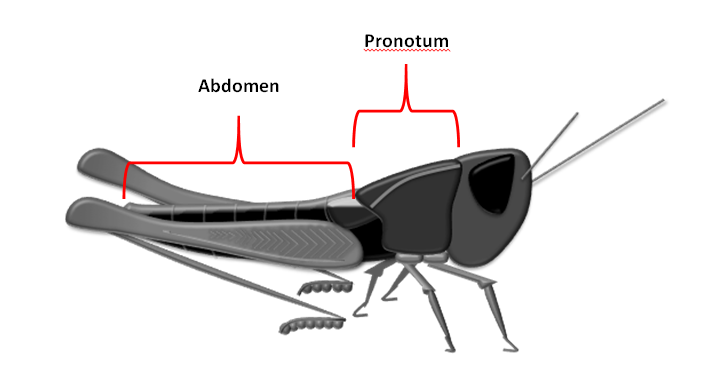

```{r setup, include=FALSE}
knitr::opts_chunk$set(echo = TRUE)
```

## Preamble

This notebook deviates from the other in this series, in that I am not embedding most of the tutorial within.  The tutorial is more of a walkthrough of multiple regression in SPSS, with lots of screen grabs.  Instead, I will capture the gist of each part and redo the work with R. Additionally, I will do some of the data cleanup in a different order.

## Part 1: Multiple regression exercise

_
The goal of this exercise is to generate an equation that allows for the prediction of the weight of female chameleon grasshoppers (Kosciuscola tristis) grasshoppers based upon morphometric (body shape) measurements taken at the time of capture for each individual.
_

_
Use the data in the file labelled Tutorial 12 Data on LEO to create this equation. This data includes measurements of…
_


 *	_The total length of each individual (in mm)_
 *	_The abdomen length of each individual (in mm)_
 *	_The pronotum length of each individual (in mm)_
 *	_The pronotum width of each individual (in mm)_
 *	_The number of eggs carried by each individual at the time of capture_
 *	_The weight of each individual (in grams)_
 


---

To begin, we'll read in the data and do some exploratory work.

```{r}
gh.df <- read.csv("Tutorial 12 Data.csv", header=TRUE,row.names=1) # name rows by specimen ID
head(gh.df)
tail(gh.df)
plot(gh.df)
gh.orig.df <- gh.df #save original copy
```

The pairwise scatterplot tableau reveals apparent correlations. We also note three distinct outliers.

Some boxplots, grouped for nice scaling:

```{r}
par(mfrow=c(2,2))
boxplot(gh.df[1:2],ylab="length (mm)")
boxplot(gh.df[3:4],ylab="length (mm)")
boxplot(gh.df[5],ylab="Egg count", xlab="Egg.count")
boxplot(gh.df[6],ylab="Total Weight (g)",xlab="Total.Weight")
```

(Unlabelled box plot is Pronotum.width. Stupid boxplot function handles names poorly.)

Recall the default R boxplot shows:

 * the median,
 * the 1st and 3rd quartiles
 * the range, excluding outliers
 * outliers (more than 1.5*IQR from the median)
 
 Let's also see some summary statistics:
 
 
```{r}
summary(gh.df)
```

...and some histograms...

```{r}

    
par(mfrow=c(3,2))
#apply(gh.df,2,hist)
for (i in colnames(gh.df)){
    hist(gh.df[,i],
         main=paste("Histogram of ",i),
         xlab=i)  # just using apply, have to fiddle with names
}
```

Here again we see evidence of outliers.

<!-- In the original presentation, we performed a trial regression, found outliers by analysing the residuals, deleted the outliers, then re-ran the regression. -->

<!-- Here we will prune outliers before we begin. Searching R's help for 'outlier' returns `outlierTest` as a builtin function implementing Bonferroni's test for outliers (based on t-scores of residuals): -->


## Parts 2 and 3: Running the Analysis; Checking Assumptions

We will perform a linear regression with `Total.Weight` as the dependent variable, all the others independent.

The tutorial workflow is to perform the regressions, in order to get the statistics needed to check the assumptions.  It will turn out that some of the data and/or groups do not meet the conditions of multiple linear regression, and are pruned from the dataset. The analysis is rerun to check the conditions again, pruning the dataset as needed each time, until all the conditions are met.

<!-- Along the way, we will request: -->
<!--  * regression coefficients with confidence intervals, -->
<!--  * partial correlations, -->
<!--  * collinearity diagnostics, -->
<!--  * studentized residuals, -->
<!--  * outliers by residuals, -->
<!--  * measures of influence (Cook's distance, leverage) -->
 
Here are the conditions required for multiple linear regression:

 1. Linear relationship between the collective independent variables and the dependent
 2. Linear relationship between each independent variable and the dependent variable
 3. Equal variances (homoscedasticity)
 4. No multicollinearity present
 5. No outliers present
 6. Residuals are normally distributed
 
To save redundancy, we will check the assumptions in a different order, to prune non-complying data early.

<!-- 2. Re-run regression. Observe assumptions 1,2 and 3 hold. Observe multicollinearity between `Total.Length` and `Abdomen.Length`. Delete `Abdomen.Length` from the analysis as having less effect on `Total.Weight` (highest p-value). -->
<!--  3. Re-run regression. Observe assumptions 1-4 hold. Observe presence of outliers as indicated by studentised residuals. Remove the outliers. -->

### Assumption 2: Partial Linearity,

From the scatterplots above, in the last row, we see that linear bands for `Total.Weight` against all the independent variables, except `Pronotum.Length` and perhaps also `Pronotum.Width`.  (The scatterplots are the same as SPSS's partial regression plots.)

We'll just review those two plots more closely:

```{r}
attach(gh.df)
par(mfrow=c(1,2))
plot(Pronotum.Width, Total.Weight)
plot(Pronotum.Length, Total.Weight)
```

We will prune `Pronotum.Length` and retain `Pronotum.Width`. (I would rather not.)

```{r}
gh.df <- subset(gh.df, select=-Pronotum.Length)
head(gh.df)
```

This assumption should no longer change if we make further data prunings, so we shall defer a recheck until all the other assumptions have been checked.

### Assumption 4: No Multicollinearity present.

A preliminary assessment can be done by reviewing the scatterplots again, in the charts not including the dependent variable.  There is a strong signal of collinearity in `Total.Length` ~ `Abdomen.Length`. I would suspect some collinearity in `Total.Length` ~ `Egg.count` as well, from the scatterplots.

In the tutorial, we assessed collinearity by checking Tolerance statistics in the SPSS coefficients table. 

In R, we have a number of statistics for assessing collinearity. I will follow the procedures in _Practical Regression and Anova using R_, (Faraway, 2002).

Let's test a model using the surviving data groups.

```{r}
gh.model <- lm(Total.Weight ~ ., gh.df)
summary(gh.model)
```

Note the high p-value associated with `Abdomen.length`.

If we generate the correlation matrix:

```{r}
round(cor(subset(gh.df,select=-Total.Weight)),3)
```

we see the high correlation betwen `Total.Length` and `Abdomen.Length` noted in the scatterplots.  We also see that `Egg.Count` is next most highly correlated with other variables too.  Again this reflects the scatterplots.

Without much explanation, we will compute some other measures of collinearity: eigenvalue condition numbers, and variance inflation factors (also in SPSS). (Note that the tolerance values we used from SPSS are the reciprocals of the VIFs.)


```{r}
x<-as.matrix(subset(gh.df,select=-Total.Weight)) # data used for computing coefficients
xx <- t(x) %*% x # transpose, matrix product
e <- eigen(xx)
e
print("Condition numbers")
e$values[1]/e$values
library(car)
vif(gh.model)
```

Big range in eigenvalue sizes, and high condition numbers:suggesting ill-conditioning.  The variance inflation factors are low for `Pronotum.Width` and `Egg.Count`, so we'll keep those, and prune one of the other two. As per Peter's suggestion,  `Abdomen.Length` is the least significant in the model, so we'll prune that, and recheck.


```{r}
gh.df <- subset(gh.df, select=-Abdomen.Length)
gh.model <- lm(Total.Weight ~ ., gh.df)
summary(gh.model)
round(cor(subset(gh.df,select=-Total.Weight)),3)
x<-as.matrix(subset(gh.df,select=-Total.Weight)) # data used for computing coefficients
xx <- t(x) %*% x # transpose, matrix product
e <- eigen(xx)
e
print("Condition numbers")
e$values[1]/e$values
library(car)
vif(gh.model)
```

All the metrics are acceptable now (but I'm not sure about the condition numbers.)

### Assumption 5: No outliers

We determine outliers on a point-wise basis. 

The `car` package has a function to identify outliers:

```{r}
outlierTest(gh.model)
```

The test identifies one candidate, grasshopper 137, rather underweight for its length and egg load.

We should also plot the  residuals as we did in the tutorial.  There are a couple of approaches.

```{r}
residualPlot(gh.model) # Pearson
plot(gh.model, which=1) #nicer, labels outliers.
#head(sort(rstandard(gh.model)))
head(sort(rstudent(gh.model)))

```

We again find E.U. 137, and we might also consider E.U. 109 too.  We will just remove grasshopper 137.

```{r}
gh.df <- gh.df[ rownames(gh.df) != "137",] #note comma
gh.model <- lm(Total.Weight ~ ., gh.df)

plot(gh.model)
```

### Assumptions 1, 3, 6, and final check.

Consider the plot of the model as it currently stands.  The residuals plot shows a uniform band against the fitted values, which satisfies assumption 1 (linear model against the collective dependent variabls), and 3, homoscedasticity.

The Q-Q plot of the residuals shows no major deviation from normality.

The residuals plot has no strong outlier, so assumption 5 is satisfied.

We recheck assumptions 2 (partial linearity) and 4 (no multicollinearity) by viewing the scatterplots of the remaining independent variables.

```{r}
plot(gh.df)
round(cor(subset(gh.df,select=-Total.Weight)),3)
```

All conditions are met.  Our final model is:
 
```{r}
summary(gh.model)
```

(The coefficients agree with the values we obtained from SPSS.)

## Part 4: creating a predictive equation

_
The equation of the line for multiple regression takes the form
_

$$y = a + b_1 x_1 + b_2 x_2 + … + b_n x_n$$

_
where $a$ = the intercept point and $b1$ is the slope of variable $x_1$, $b_2$ is the slope of variable $x_2$, and so on.
_

_
From your analysis above, generate an equation that will allow you to predict the weight of female chameleon grasshoppers (Kosciuscola tristis) grasshoppers based upon your chosen morphometric measurements. The intercept and slopes for each independent variable may be found in the Coefficients table of the SPSS output.
_

To explicitly exhibit the model formula:

```{r}
n <- length(colnames(gh.df))
header <- paste(colnames(gh.df)[n], " = ", signif(gh.model$coefficients[1],4 ))
body <- paste( " + ", signif(gh.model$coefficients[2:n],3), "*", colnames(gh.df)[1:n-1])
body <- paste(body, collapse=' ')
eqn <- paste(header, body)
print(eqn, quote = FALSE)

```

This is a display formula, but we could actually evaluate it using `eval` - but this is not a good idea usually.

This formula agrees with the results we obtained from SPSS.

_
Predict the weight of a female chameleon grasshopper with a Total Length of 26.41mm, Pronotum Width of 5.40mm carrying 7 eggs.
_

See also tutorial 7 for `predict`.

Mean estimate, and 95% confidence interval:
```{r}

predict(gh.model,data.frame(Total.Length=26.41, Pronotum.Width=5.40, Egg.Count=7), interval="c")
```

